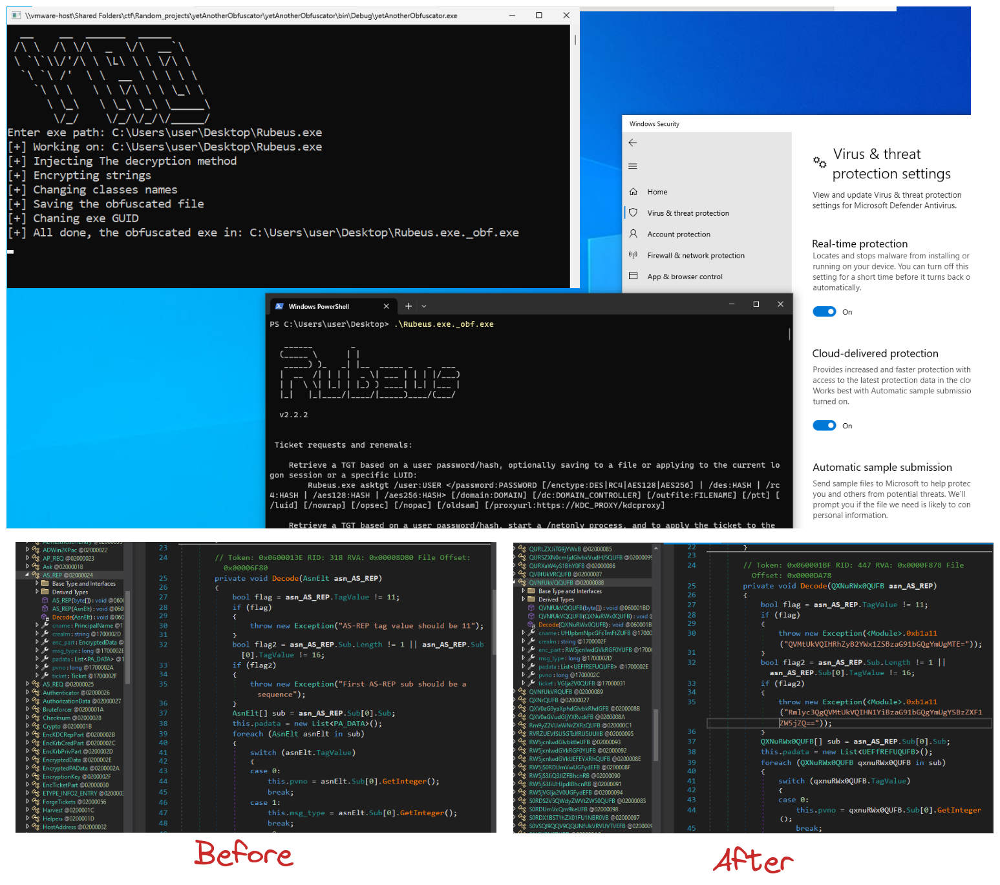

# yetAnotherObfuscator

A C# obfuscator tool that can bypass Windows Defender antivirus. I made this tool mainly as an excuse to learn more about C# and how obfuscators function.

This is an **alpha** release, so expect some nice bugs.



### Usage:

Drag drop the C# exe into yetAnotherObfuscator.exe
Or provide the C# exe as an argument:

```powershell
.\yetAnotherObfuscator.exe <PATH_TO_EXE>
```

### Contributors ✨

@Resit
